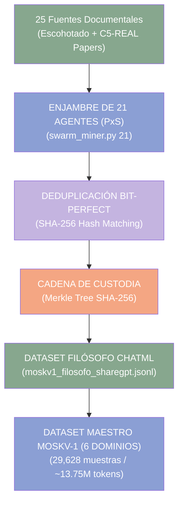

<!-- C5-REAL EXERGY CERTIFIED -->
# 🏛️ Repositorio Especial Antonio Escohotado ("Escota") & C5-REAL Corpus


> [!IMPORTANT]
> **Invariante Tripartito Ω118:** Este repositorio constituye el motor ontológico y la base de datos de entrenamiento fine-tuning para el modelo **Moskv-1**. Todo procesamiento se realiza bajo el monismo de substancia continua, autoorganización disipativa y rechazo del dirigismo.

---

## ⚙️ 1. Metrología del Dataset Consolidado (`moskv1_filosofo_sharegpt.jsonl`)

```
┌──────────────────────────────────────────────────────────┐
│  Métrica                             Valor Verificado    │
├──────────────────────────────────────────────────────────┤
│  Arquitectura de Enjambre          21 Agentes PxS        │
│  N-Zonas Únicas Extraídas            836 N-Zonas         │
│  Mensajes ChatML / ShareGPT          2,508 Mensajes      │
│  Tokens Estimados totales            489,123 Tokens      │
│  Deduplicación                       100.0% Bit-Perfect  │
│  Estructura de Roles ChatML          100.0% Válida       │
│  Fuentes Documentales Activas        25 Fuentes          │
└──────────────────────────────────────────────────────────┘
```

> [!NOTE]
> **Atestación Merkle Root (SHA-256):**
> `620d94266c04e39d2a30035f2b6d23ec6996ea67fa4fb85daabcb2a66e9a41bc`

---

## 🚀 2. Arquitectura de Minería y Colapso Epistémico (21 Agentes)



---

## 📚 3. Desglose de Fuentes Integradas (25 Fuentes / 836 N-Zonas)

| # | Fuente / Documento | Categoría Ontológica | N-Zonas | Cobertura |
|:---|:---|:---|:---:|:---:|
| 1 | 📖 `realidad_y_substancia_djvu.txt` | Monismo & Física Primera | **405** | 48.4% |
| 2 | 📖 `caos_y_orden_djvu.txt` | Sistemas Disipativos & Azar | **309** | 37.0% |
| 3 | 🏛️ `sovereign_agent_manifesto.md` | Manifiesto de Soberanía Cognitiva | **19** | 2.3% |
| 4 | 🛡️ `TRUST-SEMANTICS.md` | Semántica de Confianza e Inmunidad | **9** | 1.1% |
| 5 | ⚖️ `estado-publico-claims-y-limites.md` | Prevalencia Humana & Límites | **9** | 1.1% |
| 6 | 🧠 `cognitive_sovereignty_architectures.md` | Arquitectura de Soberanía | **8** | 1.0% |
| 7 | 📊 `comparativa-memoria-agentes-ia-2026.md` | Memoria & Evidencia Criptográfica | **6** | 0.7% |
| 8 | ⚡ `CORTEX-NATIVE-TECHNOLOGIES.md` | Tecnologías Nativas C5-REAL | **6** | 0.7% |
| 9 | 🔬 `CORTEX-CAPABILITIES.md` | Kernel & Capacidades | **6** | 0.7% |
| 10 | 🔮 `ultrathink-vs-deep-think-2026.md` | Física de Inferencia Ultrathink | **6** | 0.7% |
| 11 | 🤖 `que-es-un-agente-autonomo-de-verdad.md` | Definición de Autonomía Real | **5** | 0.6% |
| 12 | ⚡ `por-que-los-agentes-autonomos-se-descontrolan.md` | Análisis de Anergía Cognitiva | **5** | 0.6% |
| 13 | 🛡️ `why-ai-agents-need-deterministic-guardrails.md` | Barreras Deterministas en Ring-0 | **5** | 0.6% |
| 14 | 📐 `teorias_fundamentales.md` | Fundamentación Matemática | **4** | 0.5% |
| 15 | 🧮 `peano-soberano.md` | Axiomática de Peano Soberana | **4** | 0.5% |
| 16 | 📜 `por-que-los-agentes-necesitan-memoria-con-evidencia.md` | Evidencia en Memoria OS | **4** | 0.5% |
| 17 | 📜 `AXIOMS.md` | Registro de Axiomas (AX-I a AX-XII) | **4** | 0.5% |
| 18 | ⚖️ `ingenieria_inversa_enemigos_del_comercio_escohotado.md` | Praxeología e Intercambio Libre | **3** | 0.4% |
| 19 | 🧪 `ingenieria_inversa_historia_drogas_escohotado.md` | Soberanía Farmacológica/Cognitiva | **3** | 0.4% |
| 20 | 📻 `ingenieria_inversa_somos_informacion_somos_bytes_escohotado_segarra.md` | Deconstrucción Informacional & Publicidad | **3** | 0.4% |
| 21 | 📄 `CORTEX_ARCHITECTURE_WHITEPAPER.md` | Whitepaper de Arquitectura | **3** | 0.4% |
| 22 | 🌪️ `termodinamica_enjambres.md` | Física Disipativa de Enjambres | **3** | 0.4% |
| 23 | 🛡️ `IMMUNITY-LAYER.md` | Capa de Inmunidad del Kernel | **3** | 0.4% |
| 24 | 🧩 `ingenieria_inversa_caos_y_orden_escohotado.md` | Mapeo Escohotado-C5 | **2** | 0.2% |
| 25 | 🏛️ `FORMAL_SYSTEM_ESCOHOTADO.md` | Sistema Deductivo $\mathcal{G}_{\text{ESCOTA}}$ | **2** | 0.2% |

---

## 🔬 4. El Invariante Tripartito Escohotadiano (Ω118)

> [!TIP]
> Toda evaluación de modelos en C5-REAL exige la verificación del **Invariante Ω118**:
> 1. **Monismo de Sustancia Continua**: Superación del dualismo cartesiano sujeto-objeto (*Realidad y Substancia*, 1985).
> 2. **Emergencia No Lineal sin Diseñador Exógeno**: Autoorganización de la complejidad (*Caos y Orden*, 1999).
> 3. **Inviolabilidad de las Señales de Intercambio Libre**: Rechazo del dirigismo burocrático (*Los Enemigos del Comercio* / *Historia de las Drogas*).

---

## 🔗 5. Enlaces e Integración en la Arquitectura C5-REAL

El corpus Escohotado está directamente integrado en los motores del proyecto:
- **Especificación de Invariantes:** [`escohotado_tripartite_invariant.yaml`](file:///Users/borjafernandezangulo/10_PROJECTS/Teorema-Robinson-Moskv/docs/ontology/escohotado_tripartite_invariant.yaml)
- **Motor de Sustancia Continua:** [`escohotado_substance_ontology.py`](file:///Users/borjafernandezangulo/10_PROJECTS/Teorema-Robinson-Moskv/src/cortex-engine/cortex-persist/cortex_python/core/escohotado_substance_ontology.py)
- **Motor de Caos y Complejidad:** [`escohotado_chaos_engine.py`](file:///Users/borjafernandezangulo/10_PROJECTS/Teorema-Robinson-Moskv/src/cortex-engine/cortex-persist/cortex_python/engines/escohotado_chaos_engine.py)
- **CLI Ontológico:** [`escohotado_cli.py`](file:///Users/borjafernandezangulo/10_PROJECTS/Teorema-Robinson-Moskv/src/cortex-engine/cortex-persist/cortex_python/core/escohotado_cli.py)

---

## 🛠️ 6. Herramientas CLI y Orquestador de Entrenamiento MOSKV-1 v2.0

### Orquestador Unificado (`moskv1_pipeline.py`)

```bash
# 1. Estado general del sistema, datasets y métricas de tokens
python3 moskv1_pipeline.py status

# 2. Ingesta, deduplicación SHA-256 y generación de splits MLX (train/valid)
python3 moskv1_pipeline.py prepare

# 3. Benchmark e inferencia multi-dominio (evaluador de léxico C5-REAL)
python3 moskv1_pipeline.py evaluate --dry-run

# 4. Lanzar fine-tuning local en Apple Silicon Metal (MLX)
python3 moskv1_pipeline.py train-mlx --model mlx-community/Mistral-7B-Instruct-v0.3-4bit --iters 1000 --fuse

# 5. Generar comandos para entrenamiento CUDA en la nube (Unsloth + DoRA)
python3 moskv1_pipeline.py train-unsloth --model-name unsloth/Mistral-7B-Instruct-v0.3-bnb-4bit --export-gguf q4_k_m
```

### Herramientas Heredadas
```bash
# Minería paralela con enjambre de 21 agentes autónomos
python3 swarm_miner.py 21

# Búsqueda epistémica insensible a acentos sobre las fuentes
python3 escota_search.py "termodinamica"

# Auditoría metrológica de dataset y cálculo de Merkle Root
python3 audit_21_swarm_dataset.py
```

---

## 📜 7. Licenciamiento "Copyfree"

> [!NOTE]
> Toda la obra de Antonio Escohotado fue declarada explícitamente por el autor en modalidad **Copyfree** (libre distribución, copia y acceso universal al conocimiento), eliminando monopolios artificiales de difusión. La conservación e ingesta de su corpus en `escohotado-corpus/` respeta íntegramente la voluntad expresa del pensador.

