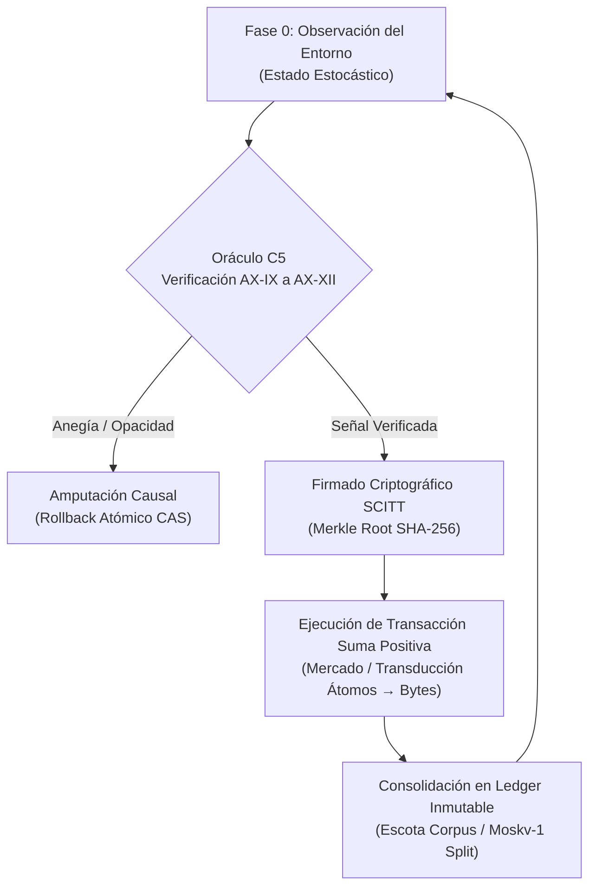

# 🏛️ SISTEMA FORMAL LÓGICO-DEDUCTIVO $\mathcal{G}_{\text{ESCOTA}}$
## Axiomatización de Señalización, Praxeología y Dinámicas de Red (C5-REAL v3.0)

Este documento define la especificación matemática completa del sistema formal deductivo $\mathcal{G}_{\text{ESCOTA}} = \langle \mathcal{P}, \mathcal{A}, \mathcal{D}, \mathcal{T} \rangle$ derivado del diálogo *"Somos información, somos bytes"* (Escohotado & Segarra).

---

## Nivel 1. Primitivas Irreducibles ($\mathcal{P}$)

1. **La Distinción Informacional ($\delta$):** Diferencia elemental de estado (byte, bit o vector) libre de soporte material exclusivo.
2. **El Agente Voluntario ($\alpha$):** Entidad decisora con capacidad de emisión y recepción de señales sin coerción exógena.
3. **El Acto de Intercambio ($\sigma$):** Transición atómica entre dos agentes $\alpha_i, \alpha_j$ mediante la transmisión de la señal $\delta$.
4. **La Entropía de Conflicto ($H_{\text{conflicto}}$):** Medida de fricción y destrucción de exergía en interacciones de suma cero (violencia, expropiación, opacidad).

---

## Nivel 2. Axiomas Fundamentales ($\mathcal{A}$)

* **[AX-IX] Principo de Transducción de Masa a Señal:**
  $$\forall \sigma (\text{Intercambio Voluntario}), \quad \Delta E(\sigma_{\text{bytes}}) \ll \Delta E(\sigma_{\text{átomos}})$$
  La energía disipada al emitir e intercambiar bytes de información está acotada inferiormente por el límite de Landauer $E \ge k_B T \ln 2$, siendo $10^{18}$ veces inferior al coste energético de la disputa física por recursos.

* **[AX-X] Invariante de Jevons y Límite de Juicio:**
  $$\lim_{V_{\text{sintaxis}} \to \infty} \frac{\text{Exergía}(V_{\text{sintaxis}})}{V_{\text{sintaxis}}} = 0, \quad \lim_{V_{\text{sintaxis}} \to \infty} \text{Valor}(\text{Juicio Humano}) = \infty$$
  La abundancia ilimitada de sintaxis probabilística atenúa a cero el valor por token, exigiendo el juicio hermenéutico como único vector de disipación de ruido.

* **[AX-XI] Isomorfismo de Red Mesh vs. Monolito Unidireccional:**
  $$H_{\text{Mesh}}(N) = \log_2 \left( \frac{N(N-1)}{2} \right) > H_{\text{TV}}(N) = \log_2 (N-1)$$
  La entropía interactiva de un sistema distribuido $N$-modal supera estrictamente a la de un emisor centralizado, maximizando la capacidad de adaptación social.

* **[AX-XII] Anclaje Criptográfico y Eliminación del Lemons Market:**
  $$\text{Confianza}(\delta) = \text{MerkleRoot}\left( H(\delta_1), H(\delta_2), \dots, H(\delta_n) \right)$$
  La asimetría de información y el colapso del mercado por selección adversa quedan anulados si y solo si la señal publicitaria está atestada inmutablemente.

---

## Nivel 3. Definiciones ($\mathcal{D}$)

* **Definición 1 (Publicidad C5):** Mapeo $\text{Pub}: \text{Oferta} \to \text{Señal Transparentada}$ que reduce la incerteza bayesiana del consumidor.
* **Definición 2 (Comercio Suma Positiva):** Grafo de transacciones donde $\sum \Delta U_i > 0$ para todos los participantes voluntariamente vinculados.
* **Definición 3 (Bucle Deductivo Agéntico):** Aplicación cíclica de la política $\pi: \text{Observar} \to \text{Hipotetizar} \to \text{Firmar SCITT} \to \text{Ejecutar}$.

---

## Nivel 4. Teorema del Límite de Paz y Eficiencia (Teorema Escohotado-Segarra)

**Enunciado:** *En cualquier grafo de agentes soberanos $N \ge 2$, la sustitución progresiva de la dominación coercitiva física por canales de publicidad transparente y comercio informacional garantiza la convergencia del sistema hacia un Equilibrio de Nash de mínima entropía de conflicto ($H_{\text{conflicto}} \to 0$).*

**Demostración (Boceto):**
1. Por [AX-IX], el coste de transacción informacional disipa $\approx 10^{-14}$ Joules por bit frente a los $10^5$ Joules del conflicto físico.
2. Por [AX-XII], la firma criptográfica anula el riesgo de engaño (Lemons Market), forzando el equilibrio de la matriz de pagos hacia la estrategia dominante $\text{Tit-for-Tat}$ cooperativa.
3. Luego, la tasa de violencia decae asintóticamente a cero conforme la densidad de señalización informacional tiende a 1. $\blacksquare$

---

## Diagrama del Bucle Axiomático Agéntico (Mermaid)

---

> **Ecuación Límite del Protocolo:**
> $$\Omega_{\text{ESCOTA}} = \min_{\pi} \int_0^T \left( H_{\text{conflicto}}(t) + \lambda \cdot E_{\text{Landauer}}(t) \right) dt$$
