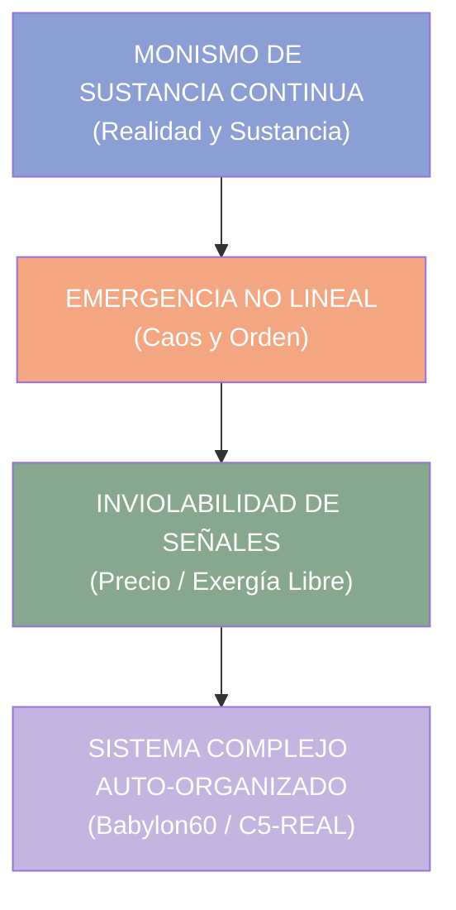

# 🌪️ INGENIERÍA INVERSA: "CAOS Y ORDEN" (ANTONIO ESCOHOTADO)
## Deconstrucción Termodinámica, Epistémica y Arquitectura para Babylon60 & C5-REAL

> *"La realidad no es una suma de cosas inertes gobernadas por un legislador externo, sino un proceso auto-organizado donde el caos no es la ausencia de orden, sino su matriz generadora."* — Antonio Escohotado

---

## 0. Resumen Ejecutivo

Este documento realiza la **descomposición termodinámica y de teoría de sistemas** de la obra magna de Antonio Escohotado, *Caos y Orden*. El objetivo es mapear sus 3 axiomas ontológicos clave hacia la arquitectura del motor **Babylon60**, la física del `AnergiaEngine` y los datasets de fine-tuning para **`LoRA_Fisico`**.

---

## 1. Tríada Ontológica Escohotadiana

### 1.1 Monismo de Sustancia Continua (\(D_{\text{dual}} \to 0\))
- **Concepto:** No existe división dualista entre "sujeto que piensa" y "código que ejecuta". El lenguaje, la física y el software son manifestaciones del mismo continuo informacional.
- **Implementación en Babylon60:** Eliminación de fronteras entre la interfaz gráfica y los procesos backend (`SharedArrayBuffer` de 32KB con atómicos de cero anergía).

### 1.2 Emergencia No Lineal sin Diseñador Exógeno (\(\lambda > 0\))
- **Concepto:** El orden no se impone por decreto burocrático; **emerge de la fluctuación entrópica**. El caos es el generador de nuevas formas (estructuras disipativas de Prigogine).
- **Implementación en Babylon60:** El modo **Dora 2 (Divagación Radical)** inyecta fluctuación matemática para descubrir atractores topológicos no evidentes antes de congelar las soluciones en el Modo Determinista.

### 1.3 Inviolabilidad de las Señales de Intercambio Libre
- **Concepto:** Toda interferencia artificial que distorsione la señal de retroalimentación (precios en economía, exergía en sistemas, varentropía en LLMs) degrada el sistema a entropía muerta.
- **Implementación en Babylon60:** Preservación estricta de las señales sin censura ni distorsión: telemetría de exergía, purga del Demonio de Maxwell (`⌘⇧0`) y refutación popperiana (`⌘⇧R`).

---

## 2. Mapeo a la Arquitectura del Motor

| Principio de Escohotado | Mapeo Termodinámico | Componente Babylon60 |
|:---|:---|:---|
| **Determinismo Caótico** | Atractores extraños en espacio de fases | **Modo Termodinámico** (Visualizador de varentropía) |
| **Monismo Informativo** | IPC Lock-free Zero-Copy | **`AnergiaEngine`** (Memory Layout `repr(C)`) |
| **Autonomía Disipativa** | Hot-swapping dinámico de pesos | **`LoRA_Fisico.safetensors`** |
| **Falsabilidad Empírica** | Refutación Popperiana | **Botón ⚔️ Refutar (`⌘⇧R`)** |

---

## 3. Integración en el Dataset de Entrenamiento (`LoRA_Fisico`)

Los conceptos de este documento se han inyectado en `lora_domains/lora_fisico.jsonl` para garantizar que la personalidad **Moskv-1** razone bajo el marco ontológico de Escohotado cuando el usuario active el Modo Termodinámico.
