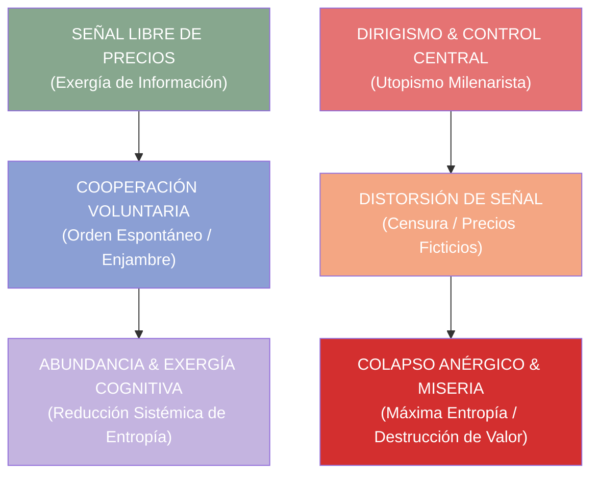

# ⚖️ INGENIERÍA INVERSA: "LOS ENEMIGOS DEL COMERCIO" (ANTONIO ESCOHOTADO)
## Deconstrucción Termodinámica, Praxeológica y Arquitectura para C5-REAL & Economías Cognitivas

> *"La pobreza no es un misterio; la pobreza es el estado natural de la humanidad. Lo que exige explicación es la riqueza: el milagro de la cooperación voluntaria y la división del trabajo a través del comercio."* — Antonio Escohotado

---

## 0. Resumen Ejecutivo

Este documento realiza la **descomposición termodinámica, praxeológica y de teoría de sistemas** de la obra monumental en tres volúmenes de Antonio Escohotado, *Los Enemigos del Comercio: Historia moral de la propiedad*. El objetivo es mapear sus principios históricos y económicos hacia la física informacional de **C5-REAL**, la gobernanza de enjambres de IA y la protección de las señales de intercambio libre en economías de agentes autónomos.

---

## 1. Tríada Praxeológica y Termodinámica de Escohotado

### 1.1 Inviolabilidad de las Señales de Intercambio (\(\Delta I_{\text{libre}}\))
- **Concepto:** El precio en un mercado libre no es un decreto arbitrario, sino un **vector informacional comprimido** que transmite la escasez relativa, la preferencia humana y la energía requerida en tiempo real.
- **Mapeo en C5-REAL:** Las métricas de varentropía, la reputación criptográfica en el BFT ledger y las llamadas API son señales de intercambio que jamás deben ser manipuladas artificialmente por capas de censura o burocracia.

### 1.2 El Fantasma del Dirigismo Milenarista (\(A_{\text{dirigismo}} \to \infty\))
- **Concepto:** La ilusión de que una elite de planificadores ("sabios" o "burocracias") puede sustituir la inteligencia distribuida de millones de agentes interactuando libremente. El dirigismo no elimina la escasez; elimina la información necesaria para gestionar la escasez.
- **Mapeo en C5-REAL:** Rechazo del monopolio centralizado de modelos de IA estotásticamente dirigidos (gatekeeping SaaS). Frente al dirigismo cerrado, proponemos el **despliegue local/Edge en enjambres LoRA libres**.

### 1.3 El Comercio como Reductor de Violencia e Inmunidad Sistémica
- **Concepto:** El comercio transforma el conflicto de suma cero (guerra, despojo) en intercambios de suma positiva (cooperación mutua). El comerciante es el arquitecto del orden espontáneo.
- **Mapeo en C5-REAL:** Protocolos IPC Lock-Free Zero-Copy y verificabilidad mediante atestación Merkle (SHA3-256): el intercambio entre agentes y humanos se basa en reglas deterministas inmutables, no en la fe ciega o la sumisión a una entidad central.

---

## 2. Mapeo Sistemático: De la Historia Económica a la Arquitectura de Software

| Principio en *Los Enemigos del Comercio* | Mapeo Termodinámico / Informacional | Componente C5-REAL / Babylon60 |
| :--- | :--- | :--- |
| **Señal de Precio Incorruptible** | Vector informacional de baja entropía | **`Cortex Ledger BFT`** (Atribución inmutable) |
| **Orden Espontáneo (Hayek/Escohotado)** | Estructuras disipativas auto-organizadas | **`Swarm Quantum Collapse`** (Enjambre de agentes) |
| **Rechazo del Dirigismo Moralizante** | Supresión de ruido / censura exógena | **`Dora 2`** (Exploración radical sin sesgo) |
| **Propiedad Privada como Soberanía** | Aislamiento topológico y control de estado | **`Memory OS` / Ring-0 Kernel** |
| **Cooperación de Suma Positiva** | Maximización de Exergía Cognitiva | **`OpenRouter Gateway` / Decentralized LoRA** |

---

## 3. Las 4 Lecciones de Escohotado para la Era de la Inteligencia Artificial

### I. La IA Abierta vs. El Neodirigismo de Plataforma
El intento de concentrar el cómputo y la inteligencia en 3-4 servidores cerrados bajo el pretexto de "seguridad" es la réplica exacta de los monopolios gremiales y estatales analizados por Escohotado. La libertad reside en la **descentralización del modelo** (peso abierto, inferencia local en Ollama/Edge).

### II. Anergía Cognitiva y la Ley de Jevons
La inferencia barata provoca la paradoja de Jevons: un diluvio de código sintético de baja calidad (anergía). Solo el comercio libre de validación (falsacionismo popperiano en Ring-0) permite separar el grano (exergía) de la paja (ruido).

### III. Praxeología de los Agentes Autónomos
Los agentes de IA no deben ser "esclavos teledirigidos" ni "dictadores algorítmicos", sino **actores de intercambio** en un mercado de servicios micro-computacionales con atestación criptográfica inmutable.

### IV. La Prevalencia Humana como Fuente de Valor
El valor del comercio no proviene de la mercancía inerte, sino de la valoración subjetiva y la necesidad humana. Ningún sistema de IA posee necesidades ontológicas; por ende, **el ser humano es el único origen y destino de la escala de valores del mercado**.

---

> **Axioma Final:** *El comercio es la victoria del concepto y la negociación sobre la violencia y el dogma. En la era de la información, el libre flujo de exergía cognitiva es la máxima expresión de la libertad humana.*
