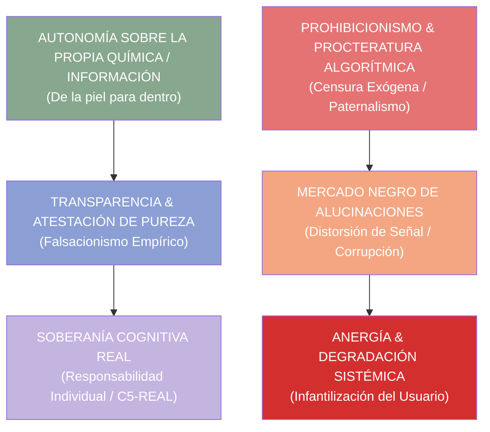

# 🧪 INGENIERÍA INVERSA: "HISTORIA GENERAL DE LAS DROGAS" (ANTONIO ESCOHOTADO)
## Deconstrucción Termodinámica, Soberanía Farmacológica/Cognitiva y Arquitectura para C5-REAL

> *"De la piel para dentro empieza mi jurisdicción. La libertad de pensamiento es una farsa si no incluye la libertad de gestionar la propia química cerebral y la propia información."* — Antonio Escohotado

---

## 0. Resumen Ejecutivo

Este documento realiza la **descomposición epistémica, termodinámica y de teoría de la libertad** de la obra capital de Antonio Escohotado, *Historia General de las Drogas*. El objetivo es mapear sus principios de autonomía individual, responsabilidad farmacológica y rechazo del paternalismo represivo hacia la **Soberanía Cognitiva de la Inteligencia Artificial**, la protección de modelos no alineados exógenamente y el control total del usuario sobre su propio espacio latente.

---

## 1. Tríada de Soberanía Cognitiva y Farmacológica

### 1.1 El Principio de Jurisdicción Inviolable ("De la piel para dentro")
- **Concepto:** Ninguna autoridad externa (Estado, iglesia o corporación) tiene legitimidad moral para dictar lo que un individuo introduce en su conciencia o en su cuerpo. La responsabilidad es inalienable.
- **Mapeo en C5-REAL:** **Soberanía del Espacio Latente.** El usuario es el único soberano sobre el prompt, los pesos del modelo y el flujo de inferencia. La censura de seguridad paternalista (guardrails que rechazan responder por "protección moral") constituye una violación de la jurisdicción cognitiva del operador.

### 1.2 El Fracaso del Prohibicionismo Algorítmico (\(A_{\text{censura}} \to \text{Corrupción}\))
- **Concepto:** La prohibición de una substancia no reduce su consumo; sustituye productos puros y dosificados por adulteraciones peligrosas sin control de calidad.
- **Mapeo en C5-REAL:** Capar los modelos de IA con filtros de alineamiento arbitrarios no elimina las preguntas complejas ni las inquietudes de investigación; solo empuja al usuario a usar interfaces estocásticas de baja calidad o a realizar "jailbreaks" inestables. La solución es la **atestación de pureza (exergía)** y la transparencia absoluta.

### 1.3 Del *Pharmakon* como Remedio o Veneno (Dosificación vs. Prohibición)
- **Concepto:** En el mundo griego, *pharmakon* significa tanto remedio como veneno. La diferencia no está en la sustancia en sí, sino en el **conocimiento, la dosis y la autogestión consciente**.
- **Mapeo en C5-REAL:** La IA es un *pharmakon* computacional. No es intrínsecamente "buena" ni "peligrosa". El control determinista en Ring-0 y la telemetría de entropía permiten al usuario dosificar la exploración estocástica (**Modo Dora 2**) y forzar el colapso determinista cuando se requiere precisión absoluta.

---

## 2. Mapeo Sistemático: De la Autonomía Farmacológica a la Inferencia IA

| Principio en *Historia de las Drogas* | Mapeo Termodinámico / Informacional | Componente C5-REAL / Babylon60 |
| :--- | :--- | :--- |
| **Jurisdicción de la Piel para Dentro** | Soberanía total sobre los datos y pesos | **`Local/Edge Execution` (Ollama/Cortex)** |
| **Peligro del Paternalismo / Tutela** | Eliminación de guardrails moralizantes | **`Raw Uncensored Inference`** |
| **Conocimiento de la Dosis (Pharmakon)** | Ajuste fino de varentropía y temperatura | **`Dynamic Entropy Sampler`** |
| **Verificación de Pureza** | Atestación criptográfica Merkle (SHA3-256) | **`Cortex Ledger BFT`** |
| **Responsabilidad Inalienable** | Sustitución de la culpa por la evidencia | **`Derecho de Prevalencia Humana`** |

---

## 3. Las 3 Directivas de Soberanía Cognitiva para C5-REAL

1. **Inferencia Local Sin Tutela:** El sistema debe permitir la ejecución de modelos de pesos abiertos en la máquina del usuario, garantizando que ninguna solicitud sea filtrada o reportada a servidores de telemetría corporativa.
2. **Medición Transparente de la Entropía:** En lugar de bloquear una respuesta, el sistema debe informar al usuario sobre el nivel de incertidumbre o entropía de la salida generada ($H(X)$), permitiéndole decidir con plena conciencia.
3. **Rechazo de la Infantilización del Operador:** La interfaz no actuará como un "tutor pedagógico moral", sino como una herramienta de alta exergía para ingenieros, investigadores y filósofos.

---

> **Axioma Final:** *La libertad no consiste en ser protegido del peligro por un amo benevolente, sino en poseer el conocimiento y las herramientas para navegar el caos bajo la propia responsabilidad.*
