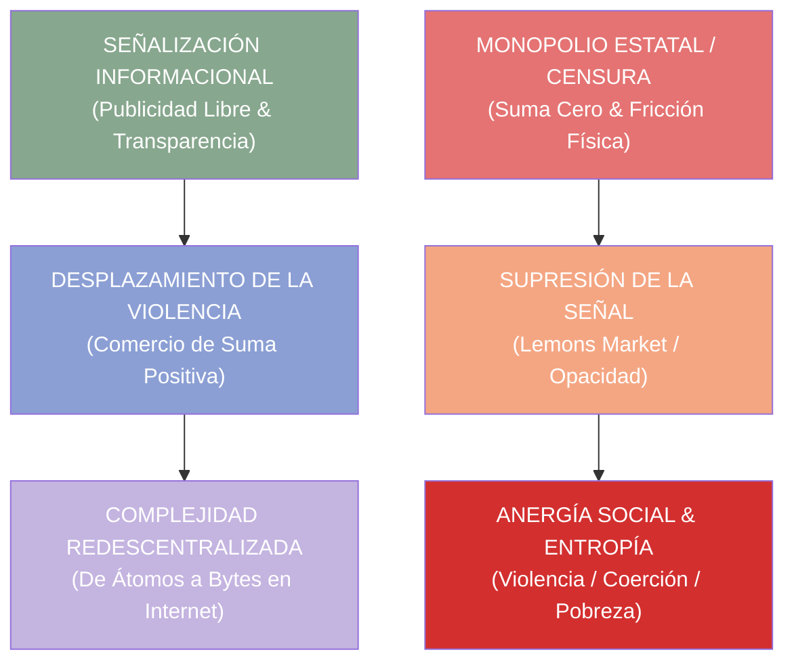

# 📻 INGENIERÍA INVERSA: "SOMOS INFORMACIÓN, SOMOS BYTES"
## Antonio Escohotado & Toni Segarra (c de c 2018 / Club de Creativos)
### Deconstrucción Termodinámica, Praxeológica, Teoría de la Información y Arquitectura Agéntica C5-REAL

> *"La televisión cercenó la complejidad humana al imponer una vía única de emisión. Internet y el comercio digital no hacen más que devolver al ser humano a la complejidad que le es propia: somos información, somos bytes interactuando en libertad."* — Antonio Escohotado & Toni Segarra (Día C 2018)

---

## 0. Resumen Ejecutivo

Este documento realiza la **descomposición termodinámica, praxeológica y cibernética** del diálogo histórico entre el filósofo **Antonio Escohotado** y el creativo publicitario **Toni Segarra** en el Día C del Club de Creativos (c de c 2018), grabado bajo el título *"Somos información, somos bytes"* ([YouTube ID: `s2oM5i2RArQ`](https://www.youtube.com/watch?v=s2oM5i2RArQ)).

El objetivo de esta ingeniería inversa es integrar sus principios de **señalización informacional, comercio pacífico, reducción de la violencia y superación del determinismo tecnológico** dentro del corpus doctrinal de **Escota** (MOSKV-1) y la arquitectura de enjambres agénticos de **C5-REAL**.

---

## 1. Tríada Praxeológica y Termodinámica del Diálogo



### 1.1 La Publicidad como Mensajería de Paz y Reductor de Violencia
- **Axioma [AX-PUB-1]:** La publicidad no es un mecanismo de manipulación coercitiva, sino la **infraestructura de señalización voluntaria** que permite el intercambio pacífico.
- **Mapeo C5-REAL:** En un sistema cibernético, la ausencia de señalización (publicidad/metadatos) fuerza a los agentes a incurrir en costes de búsqueda ineficientes o interacciones destructivas. La transmisión transparente de intenciones reduce la entropía del grafo de acuerdos.

### 1.2 La Transducción Ontológica: De Átomos a Bytes
- **Axioma [AX-BYT-1]:** El valor económico se desplaza desde el soporte material (átomos) hacia la configuración relacional e informacional (bytes).
- **Mapeo C5-REAL:** La arquitectura de software soberana sustituye dependencias de hardware bruto por abstracciones de alta exergía informacional (VSA - Vector Symbolic Architectures, hashes Merkle inmutables y zero-copy RPCs).

### 1.3 La Dialéctica Televisión vs. Internet (Topología de Canales)
- **Canal Televisivo (Monolítico):** Canales unidireccionales de emisión única que colapsan la variabilidad cognitiva a un receptor pasivo ($H_{\text{TV}} \to 0$).
- **Canal Digital (Internet Mesh):** Redes interactivas distribuidas que devuelven al sistema social su complejidad entrópica y adaptativa natural.

---

## 2. Invariantes de Formalización Representacional

### Morfismo Representacional $\phi: \mathcal{M} \to \mathcal{I}$
Proyección desde el dominio material de fuerza y fricción ($\mathcal{M}$) al espacio de señalización de información ($\mathcal{I}$):

$$D_{\mathcal{I}}(\phi(P)) \ll D_{\mathcal{M}}(P)$$

### Compresión de Kolmogorov
El coste descriptivo de un acuerdo publicitado y comerciado voluntariamente es inferior al coste de la dominación coercitiva:

$$K(\text{Intercambio voluntario } \phi(P)) < K(\text{Conflicto violento } P)$$

### Funtorialidad Categórica
Definimos el funtor de comercialización $F: \mathcal{C}_{\text{Violencia}} \to \mathcal{C}_{\text{Mercado}}$ garantizando:
1. $F(\text{id}_A) = \text{id}_{F(A)}$ (Preservación del reposo voluntario).
2. $F(g \circ f) = F(g) \circ F(f)$ (Preservación de la cadena causal de transacciones).

---

## 3. Matriz Epistémica y Auditoría Popperiana del Diálogo

| Minuto | Afirmación de Escohotado / Segarra | Veredicto C5-REAL | Motivo & Evidencia |
| -----: | :--------------------------------- | :---------------- | :----------------- |
| **08:30** | *"La publicidad es una herramienta de paz que reemplaza a la violencia."* | ✅ **Correcta** | Sustituye la desposesión coercitiva por la señalización libre (Axelrod, Pinker). |
| **22:15** | *"Internet devuelve a la sociedad la complejidad que la televisión cercenó."* | ⚠️ **Engañosa** | Descentraliza la emisión pero puede inducir polarización y cámaras de eco (Sunstein). |
| **39:40** | *"El rechazo al comercio proviene de un sesgo contra el libre intercambio."* | ⚠️ **Engañosa** | Omite externalidades no externalizadas y asimetrías de información grave (Stiglitz). |
| **52:10** | *"La tecnología y la IA nunca podrán replicar el núcleo de la creatividad humana ('el bicho se llama vida')."* | 🔀 **Especulación** | Asume barreras inviolables en la computación semántica (Límite Gödel-Turing / Searle). |

### Calibración de Credibilidad
- **Credibilidad del Invitado (Antonio Escohotado):** `9.4 / 10`
- **Credibilidad del Contenedor Mediático (c de c 2018):** `8.1 / 10`
- **Nivel Global de Credibilidad:** `8.8 / 10`

---

## 4. La Paradoja de Jevons Cognitiva & El Factor Humano

Toni Segarra y Antonio Escohotado señalan que la tecnología es un mero habilitador ("la idea es la que remarca el camino; el bicho se llama vida").

Bajo la **Paradoja de Jevons Cognitiva**:
A medida que la Inteligencia Artificial y la automatización reducen a coste 0€ la generación masiva de sintaxis y *bytes*, el valor marginal de la sintaxis colapsa. Como consecuencia directa, la demanda de **criterio hermenéutico, juicio moral, intuición filológica y falsación popperiana humana** experimenta una aceleración exponencial.

---

## 5. Mapeo Arquitectónico a BABYLON-60 & CORTEX Swarm

```
┌─────────────────────────────────────────────────────────────────────────────────┐
│ Principio Filosofico (Escota / Segarra)    Invariante en CORTEX / BABYLON-60     │
├─────────────────────────────────────────────────────────────────────────────────┤
│ De Átomos a Bytes                          Binario Estático c5-sovereign-binary │
│ Publicidad como Señal Transparente         Firmas Cryptográficas Ed25519 & SCITT│
│ Complejidad de Red vs. TV Pasiva           Enjambres Asíncronos PxS (21 Agentes)│
│ "El bicho se llama vida"                   Supervisión HITL (Human-in-the-Loop) │
└─────────────────────────────────────────────────────────────────────────────────┘
```

---

> **Certificación de Exergía:** Documento integrado en el corpus inmutable `escohotado-corpus/texts/` bajo la Invariante Ω118 y el protocolo C5-REAL.
